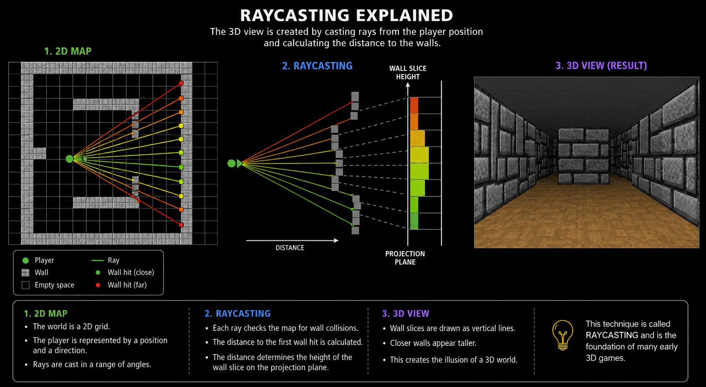

*This project has been created as part of the 42 curriculum by jmarques, ngusev.*

# Cub3D

Cub3D is a simple 3D graphics project inspired by the classic game Wolfenstein 3D. The goal of the project is to create a first-person perspective inside a maze using the raycasting technique.

The program is developed in C using the MiniLibX graphics library. The player can move through the map, rotate the camera, and interact with the environment rendered in real time.

## Main Features

- First-person 3D visualization
- Raycasting engine
- Wall textures
- Keyboard movement and camera rotation
- Custom map parsing from .cub files
- Collision detection
- Floor and ceiling colors
- Real-time rendering

## Technologies Used

- Language: C
- Graphics Library: MiniLibX
- Algorithms: Raycasting, vector math, texture mapping

## Project Structure
```text
src
├── bonus
│   ├── door_interact_bonus.c
│   ├── door_state_bonus.c
│   ├── door_texture_parse_bonus.c
│   ├── door_texture_render_bonus.c
│   ├── door_tiles_bonus.c
│   └── map_store_bonus.c
├── game
│   ├── hooks.c
│   ├── player_aux.c
│   ├── player.c
│   ├── raycaster.c
│   ├── ray_draw.c
│   ├── render.c
│   ├── textures.c
│   └── window.c
├── input
│   ├── check_map.c
│   ├── checks.c
│   ├── map_store.c
│   ├── parse_color.c
│   ├── parse_cub.c
│   ├── parse_line.c
│   ├── parse_texture.c
│   └── read_map.c
├── main.c
└── utils
    ├── bonus_utils2.c
    ├── bonus_utils.c
    ├── free.c
    └── parsing.c
include
├── cub3d_base.h
├── cub3d_bonus.h
├── cub3d.h
└── defines.h
```
## Instructions
git clone https://github.com/Sheihesinusslon/cub3d.git
cd cub3d

## Compile and Run

There are two versions of the program, the mandatory part and the bonus part. The bonus part adds wall collision, a minimap, open and close doors and the ability to rotate the view by moving the mouse.

To compile the mandatory part, cd into the cloned directory and:
- make

To compile the bonus part, cd into the cloned directory and:
- make bonus

To run the program:
- ./cub3d <path/to/map.cub>

The program takes a map file as an argument. Maps are available in the maps directory. There are good maps which the program should run smoothly with, and bad maps which the program should reject. For example:

- `./cub3d maps/valid_maps/subject.cub` should run.
- `./cub3d maps/invalid_maps/no_map.cub` should print an error and abort.

## Controls

Controls for movement and rotation are:

- `W`: move forward
- `S`: move backward
- `A`: strafe left
- `D`: strafe right
- `E`: open/close door (bonus only)
- `left arrow`: rotate left
- `right arrow`: rotate right
- `mouse`: rotate by moving the mouse

## Example `.cub` File

```text
NO ./textures/north.xpm
SO ./textures/south.xpm
WE ./textures/west.xpm
EA ./textures/east.xpm

F 100,100,100
C 50,50,150

1111111111111
1000000000001
1011110111101
1000010000001
1000N00000001
1011111111101
1000000000001
1111111111111
```

| Character | Description               |
| --------- | ------------------------- |
| `1`       | Wall                      |
| `0`       | Empty space               |
| `N`       | Player spawn facing North |
| `S`       | Player spawn facing South |
| `E`       | Player spawn facing East  |
| `W`       | Player spawn facing West  |

# Configuration
- NO, SO, WE, EA define wall textures.
- F defines the floor RGB color.
- C defines the ceiling RGB color.

## Testing

The project includes automated shell scripts to test both valid maps and error handling.

### Run valid map tests

```bash
./tests/run_tests.sh
```
This script launches a series of valid .cub maps to verify:

- Map parsing
- Texture loading
- Player initialization
- Rendering behavior
- General game stability

```bash
./tests/test_errors.sh
```
This script checks invalid configurations and map errors such as:
- Invalid map format
- Missing textures
- Incorrect colors
- Open mapsInvalid characters
- Parsing failures

If the scripts are not executable, run:

```bash
chmod +x tests/run_tests.sh
chmod +x tests/test_errors.sh
```

## Features

| Feature | Mandatory | Bonus |
|---------|------------|-------|
| Raycasting | ✅ | ✅ |
| Textured walls | ✅ | ✅ |
| Collision detection | ✅ | ✅ |
| Minimap | ❌ | ✅ |
| Doors | ❌ | ✅ |
| Mouse rotation | ❌ | ✅ |

## Available Make Commands

| Command | Description |
|---------|-------------|
| `make` | Compile mandatory |
| `make bonus` | Compile bonus |
| `make clean` | Remove object files |
| `make norm` | Run norminette |
| `make test` | Run test file |
| `make fclean` | Remove binaries |
| `make re` | Recompile project |

## Error Handling

The parser validates:
- Map enclosure
- Duplicate player positions
- Invalid characters
- Missing textures
- RGB formatting
- Empty lines inside maps
- Invalid `.cub` extensions

## How Raycasting Works

## How Raycasting Works

The engine simulates a 3D environment using a 2D map.

For every vertical column of pixels on the screen, a ray is cast from the player's position in the viewing direction until it hits a wall.

The distance between the player and the wall determines the height of the wall slice rendered on screen, creating the illusion of depth and a 3D environment.

<p align="center">
  
</p>
